# Calculator

Calculator is a CLI writen in Go for computing math operations over translation metrics.

# Overview

Calculator provides a simple interface to apply math operations over a specifc data scenario.

Calculator provides:

* Simple Moving Average(sma)
* more functionalities TBD

# Data scenario

Considering a translation event in the format:

```json
{
	"timestamp": "2018-12-26 18:12:19.903159",
	"translation_id": "5aa5b2f39f7254a75aa4",
	"source_language": "en",
	"target_language": "fr",
	"client_name": "airliberty",
	"event_name": "translation_delivered",
	"duration": 20,
	"nr_words": 100
}
```

When interested in calculating, for every minute, a moving average(sma) of the translations delivery time for the last X minutes, you can call calculator as bellow:

```bash
calculator --input_file events.json --window_size 10
```

The output will be write in a resukt.txt file, and should look like:

````txt
{"date":"2018-12-26 18:11:00","average_delivery_time":0}
{"date":"2018-12-26 18:12:00","average_delivery_time":20}
{"date":"2018-12-26 18:13:00","average_delivery_time":20}
{"date":"2018-12-26 18:14:00","average_delivery_time":20}
{"date":"2018-12-26 18:15:00","average_delivery_time":20}
{"date":"2018-12-26 18:16:00","average_delivery_time":25.5}
{"date":"2018-12-26 18:17:00","average_delivery_time":25.5}
{"date":"2018-12-26 18:18:00","average_delivery_time":25.5}
{"date":"2018-12-26 18:19:00","average_delivery_time":25.5}
{"date":"2018-12-26 18:20:00","average_delivery_time":25.5}
{"date":"2018-12-26 18:21:00","average_delivery_time":25.5}
{"date":"2018-12-26 18:22:00","average_delivery_time":31}
{"date":"2018-12-26 18:23:00","average_delivery_time":31}
{"date":"2018-12-26 18:24:00","average_delivery_time":42.5}
````

# Installing

Using Calculator is easy.

Clone the repo and run:

````bash
make build
````

calculate with:

```bash
calculator --input_file events.json --window_size 10
```

# Future improvements(TODOs)

TBD

# Benchmark

We Benchmarked the two solutions:

* SMA: run over **ALL** events for each minute window.
* FIFOSMA - Uses **FIFO** to main only events from the current minute.

Using a sample of 100k events, we did `benchstat` for 3 metrics:

* `sec/op` (seconds per operation)
* `B/op` (bytes allocated per operation)
* `allocs/op` (allocations* per operation) 

\*allocation means 'on HEAP'

Let's check the results:


### Time per Operation (`sec/op`)

| Metric   | SMA-8 (sec/op)  | FIFOSMA-8 (sec/op) | Improvement                        |
|----------|-----------------|--------------------|------------------------------------|
| Time/op  | 54.09 ± 6%      | 0.02455 ± 3%       | `SMA-8` is ~2204 times slower      |

### Memory Allocated per Operation (`B/op`)

| Metric    | SMA-8 (B/op)    | FIFOSMA-8 (B/op)   | Improvement                         |
|-----------|-----------------|--------------------|-------------------------------------|
| Memory/op | 64.49 MiB ± 0%  | 38.20 MiB ± 0%     | `FIFOSMA-8` uses ~40.8% less memory |

### Allocations per Operation (`allocs/op`)

| Metric       | SMA-8 (allocs/op) | FIFOSMA-8 (allocs/op) | Improvement                             |
|--------------|-------------------|-----------------------|-----------------------------------------|
| Allocations/op | 105.9k ± 0%     | 30.72k ± 0%           | `FIFOSMA-8` has ~71% fewer allocations  |

### Explanation:

- **Time Efficiency**: `FIFOSMA-8` is approximately 2204 times faster than `SMA-8` (54.09 / 0.02455 ≈ 2204).
- **Memory Efficiency**: `FIFOSMA-8` uses about 40.8% less memory per operation compared to `SMA-8` (64.49 MiB / 38.20 MiB ≈ 1.69, meaning `FIFOSMA-8` uses approximately 1/1.69 of the memory, which is about 59.2% of the memory used by `SMA-8`).
- **Allocation Efficiency**: `FIFOSMA-8` has about 71% fewer allocations per operation than `SMA-8` (105.9k / 30.72k ≈ 3.45, meaning `FIFOSMA-8` has approximately 1/3.45 of the allocations, which is about 29% of the allocations used by `SMA-8`).

`FIFOSMA-8` is significantly more efficient in terms of **execution time**, **memory usage**, and the **number of allocations** per operation compared to `SMA-8`.

We have a point to use `FIFOSMA`! =D

# Benchmark/Profiling going futher!
The best way to make your application faster is by improving inefficient code. But how can you tell which code is inefficient?
You've got to measure it! Go has you covered with the built-in pprof toolset.

Types Of Profiling:

There are five types of profiling: but lets focus on two:

CPU Profile:

* "CPU Profiling is the most common type of profiling, and in general, the one you should start with first. It works by interrupting the program every 10ms and recording the stack trace of currently running goroutines."

Memory:

* "The memory profiler shows the functions that allocate memory to the heap. It can track in use allocations, as well as total allocations that have happened since the program started.
As a rule, if you want to increase speed, you want to reduce allocated objects, if you want to reduce memory consumption, you want to look at in use objects."

This was taken from a course I did: https://www.gopherguides.com/courses/profiling-optimizing-golang-training

## CPU Profiling

We ran:

go test ./cmd -run=\^\$\$ -bench=^BenchmarkFIFOSMA$$ -cpuprofile=fifocpu.pprof -count=10 > fifocpuprof.bench

then 'top' and 'list' 'FIFOSMA':
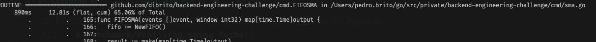

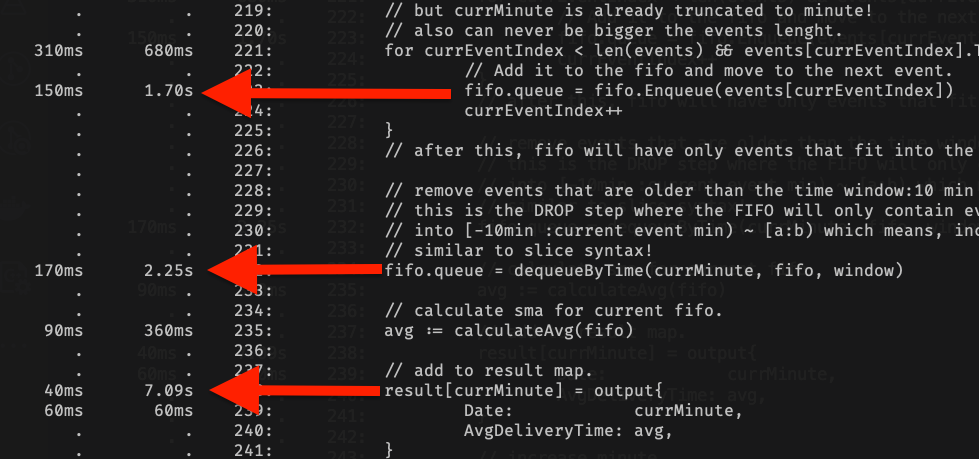

Let created a 'FIFOSMA' without comments to have a better visibility: FIFOSMAMinified

We re-run:

- make benchfifocpuprof
- pprof fifocpu.pprof
- list FIFOSMAMinified

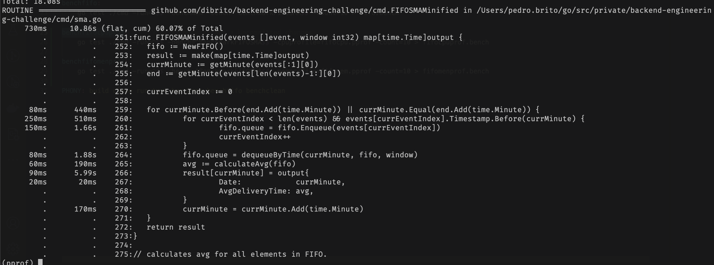

It's possible to notice that:

- fifo.Enqueue ~1.66s
- dequeueByTime ~1.88s
- and the map assign result[currMinute] ~5.99s

Were taking about seconds CUM time spent.
CUM is how much time was spent in the function and any internall func calls;

There's a significant amount of time spent in map assignment, our map size is large, let's consider some strategies:

* Preallocate the Map Size

* Use a Slice instead of a Map since we know the minutes are ordered;

Lets compare both approachs, but I got a feeling slice will be better! Slice is the most mechanical sympathetic struct that related to the hardware!

Map result:

Didn't improve much!!

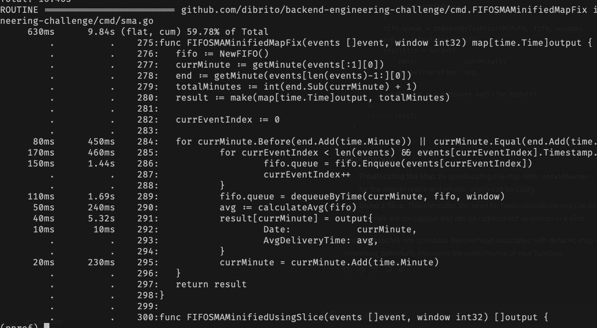

Slice result:

Total Minutes:5997120000000001 is way bigger a slice can support! For 100k entries.

So we will probably stick to the map, lets compare with previous version where we did not set the map size:

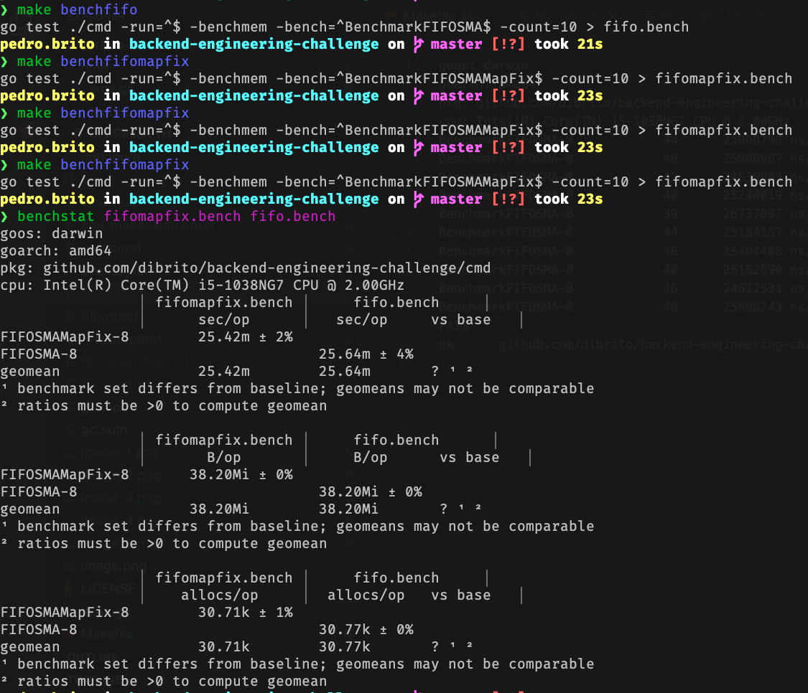

Seems weird to have the preatty much no improvement pre-allocating the map. We've must done something wrong!

Let's check cpuprofiling

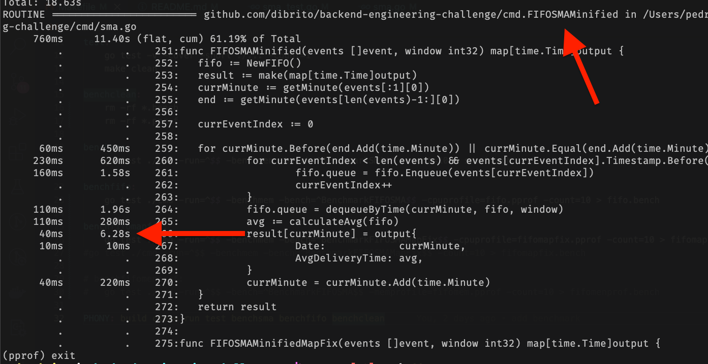

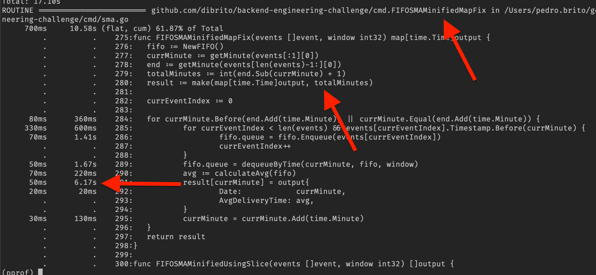

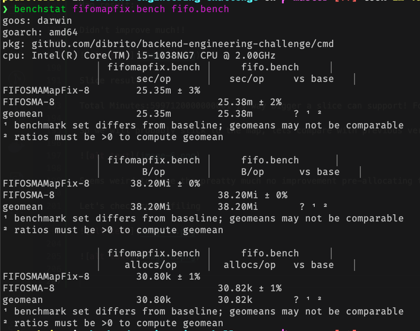

There's no real significant improve!
Let's try to mem profiling!


## Memory Profiling

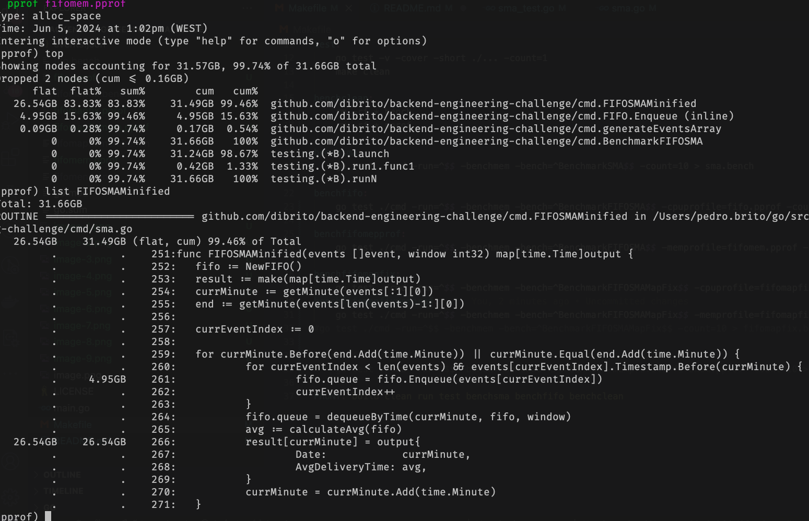

There's a  significant memory usage by the append function in Enqueue and again the map assign(We can't get ride of the map, so let's focus on the FIFO).
Which means that the queue's underlying slice is growing and reallocating frequently, which can lead to high memory consumption.

We could:

- pre-allocate the queue lenght(marking events start index and final index to then count and pre-allocate queue size)
but pre-allocating size have shown unefficient before, we might need another solution;

But before, let change our current FIFO to use a pointer! and check any improvemts.

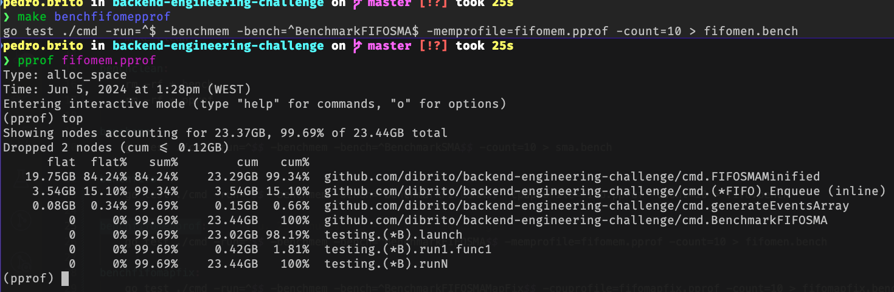

We reduced data usage a little bit ~10GB!!

But I'm still not happy! Let's review the SMA concept!

https://en.wikipedia.org/wiki/Moving_average

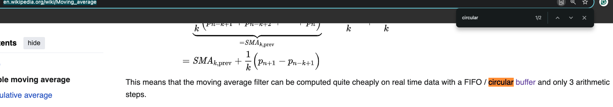

Use a Circular FIFO can be more memory efficient! Let's give it a try! 
Let's commit cause we've DONE a lot already!