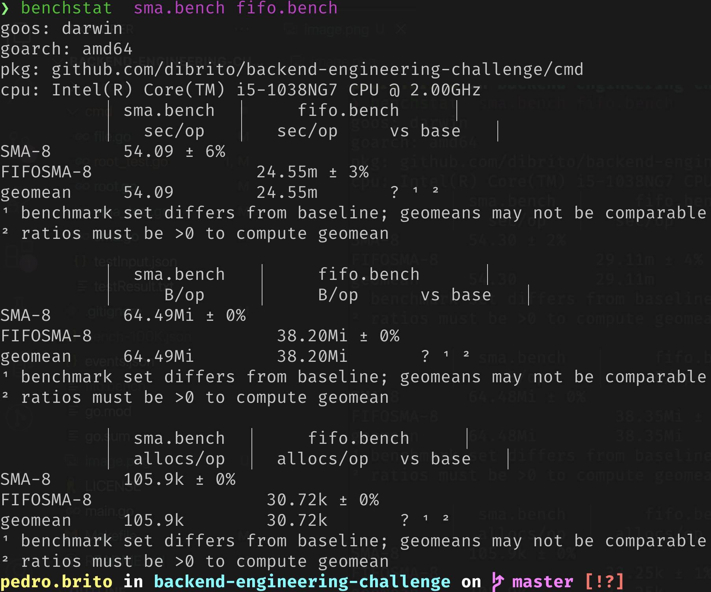

# Calculator

Calculator is a CLI writen in Go for computing math operations over translation metrics.

# Overview

Calculator provides a simple interface to apply math operations over a specifc data scenario.

Calculator provides:

* Simple Moving Average(sma)
* more functionalities TBD

# Data scenario

Considering a translation event in the format:

```json
{
	"timestamp": "2018-12-26 18:12:19.903159",
	"translation_id": "5aa5b2f39f7254a75aa4",
	"source_language": "en",
	"target_language": "fr",
	"client_name": "airliberty",
	"event_name": "translation_delivered",
	"duration": 20,
	"nr_words": 100
}
```

When interested in calculating, for every minute, a moving average(sma) of the translations delivery time for the last X minutes, you can call calculator as bellow:

```bash
calculator --input_file events.json --window_size 10
```

The output will be write in a resukt.txt file, and should look like:

````txt
{"date":"2018-12-26 18:11:00","average_delivery_time":0}
{"date":"2018-12-26 18:12:00","average_delivery_time":20}
{"date":"2018-12-26 18:13:00","average_delivery_time":20}
{"date":"2018-12-26 18:14:00","average_delivery_time":20}
{"date":"2018-12-26 18:15:00","average_delivery_time":20}
{"date":"2018-12-26 18:16:00","average_delivery_time":25.5}
{"date":"2018-12-26 18:17:00","average_delivery_time":25.5}
{"date":"2018-12-26 18:18:00","average_delivery_time":25.5}
{"date":"2018-12-26 18:19:00","average_delivery_time":25.5}
{"date":"2018-12-26 18:20:00","average_delivery_time":25.5}
{"date":"2018-12-26 18:21:00","average_delivery_time":25.5}
{"date":"2018-12-26 18:22:00","average_delivery_time":31}
{"date":"2018-12-26 18:23:00","average_delivery_time":31}
{"date":"2018-12-26 18:24:00","average_delivery_time":42.5}
````

# Installing

Using Calculator is easy.

Clone the repo and run:

````bash
make build
````

calculate with:

```bash
calculator --input_file events.json --window_size 10
```

# Future improvements(TODOs)

TBD

# Benchmark

We Benchmarked the two solutions:

* SMA: run over **ALL** events for each minute window.
* FIFOSMA - Uses **FIFO** to main only events from the current minute.

Using a sample of 100k events, we did `benchstat` for 3 metrics:

* `sec/op` (seconds per operation)
* `B/op` (bytes allocated per operation)
* `allocs/op` (allocations* per operation) 

\*allocation means 'on HEAP'

Let's check the results:



### Time per Operation (`sec/op`)

| Metric   | SMA-8 (sec/op)  | FIFOSMA-8 (sec/op) | Improvement                        |
|----------|-----------------|--------------------|------------------------------------|
| Time/op  | 54.09 ± 6%      | 0.02455 ± 3%       | `SMA-8` is ~2204 times slower      |

### Memory Allocated per Operation (`B/op`)

| Metric    | SMA-8 (B/op)    | FIFOSMA-8 (B/op)   | Improvement                         |
|-----------|-----------------|--------------------|-------------------------------------|
| Memory/op | 64.49 MiB ± 0%  | 38.20 MiB ± 0%     | `FIFOSMA-8` uses ~40.8% less memory |

### Allocations per Operation (`allocs/op`)

| Metric       | SMA-8 (allocs/op) | FIFOSMA-8 (allocs/op) | Improvement                             |
|--------------|-------------------|-----------------------|-----------------------------------------|
| Allocations/op | 105.9k ± 0%     | 30.72k ± 0%           | `FIFOSMA-8` has ~71% fewer allocations  |

### Explanation:

- **Time Efficiency**: `FIFOSMA-8` is approximately 2204 times faster than `SMA-8` (54.09 / 0.02455 ≈ 2204).
- **Memory Efficiency**: `FIFOSMA-8` uses about 40.8% less memory per operation compared to `SMA-8` (64.49 MiB / 38.20 MiB ≈ 1.69, meaning `FIFOSMA-8` uses approximately 1/1.69 of the memory, which is about 59.2% of the memory used by `SMA-8`).
- **Allocation Efficiency**: `FIFOSMA-8` has about 71% fewer allocations per operation than `SMA-8` (105.9k / 30.72k ≈ 3.45, meaning `FIFOSMA-8` has approximately 1/3.45 of the allocations, which is about 29% of the allocations used by `SMA-8`).

`FIFOSMA-8` is significantly more efficient in terms of **execution time**, **memory usage**, and the **number of allocations** per operation compared to `SMA-8`.

We have a point to use `FIFOSMA`! =D